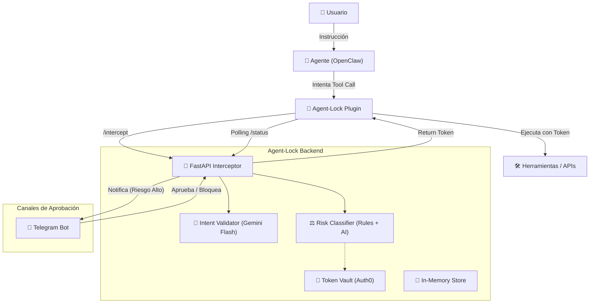

# 🛡️ Arquitectura de Agent-Lock

Agent-Lock es una **capa de gobernanza y seguridad** diseñada para interceptar, validar y autorizar las acciones de agentes de IA (inicialmente enfocado en OpenClaw).

## 1. Visión General

El sistema actúa como un "firewall semántico". En lugar de permitir que un agente use credenciales de larga duración y ejecute cualquier comando, Agent-Lock:
1. Intercepta la intención del agente.
2. La contrasta con la instrucción original del usuario.
3. Clasifica el riesgo.
4. Solicita aprobación humana si es necesario.
5. Inyecta tokens efímeros y de mínimos permisos para la ejecución.

---

## 2. Diagrama de Componentes (Mermaid)

---

## 3. Desglose de Módulos

### 🧠 Intent Validator (`backend/engine/intent_validator.py`)
Utiliza **Gemini 2.0 Flash** para un análisis semántico profundo.
- **Entrada:** Instrucción del usuario vs. Acción técnica del agente.
- **Salida:** Score (0-1), lista de contradicciones y análisis en lenguaje natural.
- **Fallback:** Sistema basado en palabras clave si la API de IA falla.
- **Detección de intent vacío:** Si el `user_intent` es genérico (ej: `"[sesión OpenClaw]"`), Gemini NO es invocado. Se retorna un score neutral (0.85) para no escalar el riesgo sin evidencia real.

### ⚖️ Risk Classifier (`backend/engine/risk_classifier.py`)
Motor híbrido de decisión que asigna niveles: `LOW`, `HIGH`, `CRITICAL`.
- **Reglas Estáticas:** Patrones Regex en `action_rules.py` (ej: bloquea `rm -rf`, `DROP TABLE`).
- **`LOW_SHELL_PATTERNS`:** Lista de comandos explícitamente seguros (`Write-Host`, `echo`, `Get-*`, `ls`, etc.). Si el contenido del comando coincide, **baja** el riesgo del tool (ej: `exec` es `HIGH` por defecto, pero `exec Write-Output hola` se clasifica como `LOW`).
- **Escalación por IA:** Solo si Gemini detecta contradicciones explícitas **Y** el score es `< 0.3`.
- **Políticas Dinámicas:** Soporte para `policies.json` para reglas de negocio personalizadas.

### 🔑 Token Vault (`backend/auth/token_vault.py`)
Integración con **Auth0** para eliminar el uso de credenciales "hardcoded".
- Solicita tokens de acceso efímeros (short-lived).
- Asigna **Scopes** según la herramienta (ej: `read:files`, `write:db`).
- El agente nunca ve la "Secret Key" maestra, solo el token de sesión.

### 📱 Notification System (`backend/notifications/telegram_bot.py`)
Maneja el flujo de **Human-in-the-loop (HITL)**.
- Envía tarjetas de aprobación con detalles del riesgo y análisis de la IA.
- Recepción de callbacks para aprobar o bloquear acciones en tiempo real.
- **Nota:** Requiere un bot de Telegram **separado** al que usa el agente (OpenClaw) para evitar el error `409 Conflict` de `getUpdates`.

### 🔌 Plugin de OpenClaw (`plugin/agent-lock-plugin/src/index.ts`)
Capa de interceptación que corre dentro del proceso de OpenClaw.
- **Captura del User Intent:** Usa dos mecanismos del SDK de OpenClaw para obtener el mensaje real del usuario:
  1. `api.onMessage(ctx)` → captura el texto crudo al llegar al gateway (`ctx.message.body`), lo guarda en RAM indexado por `ctx.sessionKey`.
  2. `hooks.before_prompt_build(ctx)` → accede al historial completo `ctx.session.messages[]`, filtra `role === "user"` y guarda el último mensaje.
- **Lectura de argumentos:** OpenClaw pasa los parámetros del tool en `event.params` (no `event.args`).
- **Polling dual:** Espera la decisión del usuario via polling al backend (`/status/{id}`) o via `api.registerTool("agent_lock_respond")` si el usuario responde en el chat.

---

## 4. Flujo de Datos (Tool Call Intercept)

1. **Interceptación:** El plugin captura el `tool_call` antes de enviarlo a la herramienta.
2. **Análisis:** El backend recibe el contexto y ejecuta el Intent Validator + Risk Classifier.
3. **Decisión Automática (Riesgo LOW):**
   - Se solicita un token a Auth0.
   - El backend responde inmediatamente con el token.
   - El plugin ejecuta la herramienta.
4. **Decisión Manual (Riesgo HIGH/CRITICAL):**
   - El backend responde con estado `PENDING`.
   - El plugin entra en un ciclo de polling.
   - Se envía mensaje a Telegram.
   - El humano aprueba → El backend inyecta el token en la siguiente respuesta de polling.
   - El plugin ejecuta la herramienta.

---

## 6. Hallazgos del SDK de OpenClaw (Gained in Production)

Estos detalles fueron descubiertos analizando el comportamiento real de OpenClaw en producción:

| Hallazgo | Detalle |
|---|---|
| **`event.params` vs `event.args`** | OpenClaw pasa los argumentos del tool en `event.params`, no en `event.args`. El evento `before_tool_call` solo contiene `{ toolName, params }`. |
| **User intent no incluido** | El evento `before_tool_call` NO incluye el mensaje original del usuario. Hay que capturarlo por separado. |
| **`api.onMessage(ctx)`** | Hook que dispara al llegar un mensaje al gateway. Contiene `ctx.message.body` y `ctx.sessionKey`. Es el método correcto para capturar el prompt del usuario. |
| **`hooks.before_prompt_build(ctx)`** | Hook de ciclo de vida con acceso a `ctx.session.messages[]`. Permite filtrar por `role === "user"` y leer el historial completo. |
| **Tool name `exec`** | OpenClaw usa `exec` como tool genérico para ejecutar shell commands. El comando real viene en `params.command`. |
| **Conflict 409 en Telegram** | Si OpenClaw y Agent-Lock comparten el mismo bot token de Telegram, el `getUpdates` entra en conflicto. Solución: usar bots separados. |

---

## 7. Estado Actual y Observaciones

> [!NOTE]
> Actualmente la arquitectura se encuentra en fase de **MVP Profesional Estabilizado**.

- **Almacenamiento:** El sistema usa un almacén en memoria (`store.py`). Próxima mejora: Redis.
- **Auditoría:** Todas las acciones se registran en `backend/audit/logs/` con formato JSON estructurado.
- **Aislamiento:** El backend es agnóstico; el contrato de API permite integrar otros agentes además de OpenClaw.
- **Auth0:** Configurado con la API `https://agent-lock-api` y los scopes `read:files`, `write:db`, `admin:execute`, etc.

---
*Documentación actualizada el 11 de Marzo, 2026.*
