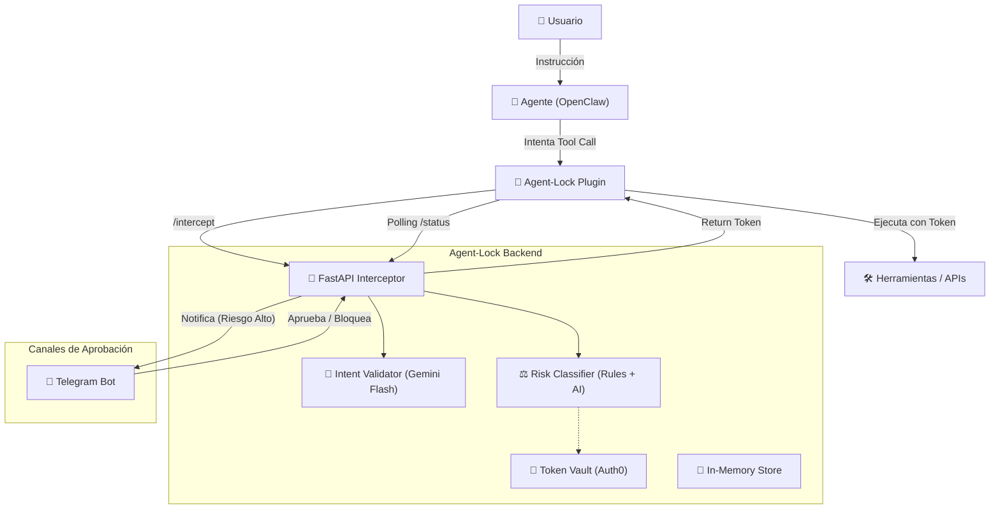

# 🛡️ Arquitectura de Agent-Lock

Agent-Lock es una **capa de gobernanza y seguridad** diseñada para interceptar, validar y autorizar las acciones de agentes de IA (inicialmente enfocado en OpenClaw).

## 1. Visión General

El sistema actúa como un "firewall semántico". En lugar de permitir que un agente use credenciales de larga duración y ejecute cualquier comando, Agent-Lock:
1. Intercepta la intención del agente.
2. La contrasta con la instrucción original del usuario.
3. Clasifica el riesgo.
4. Solicita aprobación humana si es necesario.
5. Inyecta tokens efímeros y de mínimos permisos para la ejecución.

---

## 2. Diagrama de Componentes (Mermaid)

---

## 3. Desglose de Módulos

### 🧠 Intent Validator (`backend/engine/intent_validator.py`)
Utiliza **Gemini 2.0 Flash** para un análisis semántico profundo.
- **Entrada:** Instrucción del usuario vs. Acción técnica del agente.
- **Salida:** Score (0-1), lista de contradicciones y análisis en lenguaje natural.
- **Fallback:** Sistema basado en palabras clave si la API de IA falla.

### ⚖️ Risk Classifier (`backend/engine/risk_classifier.py`)
Motor híbrido de decisión que asigna niveles: `LOW`, `HIGH`, `CRITICAL`.
- **Reglas Estáticas:** Patrones Regex en `action_rules.py` (ej: bloquea `rm -rf`, `DROP TABLE`).
- **Escalación por IA:** Si el score del Intent Validator es bajo, el riesgo sube automáticamente.
- **Políticas Dinámicas:** Soporte para `policies.json` para reglas de negocio personalizadas.

### 🔑 Token Vault (`backend/auth/token_vault.py`)
Integración con **Auth0** para eliminar el uso de credenciales "hardcoded".
- Solicita tokens de acceso efímeros (short-lived).
- Asigna **Scopes** según la herramienta (ej: `read:files`, `write:db`).
- El agente nunca ve la "Secret Key" maestra, solo el token de sesión.

### 📱 Notification System (`backend/notifications/telegram_bot.py`)
Maneja el flujo de **Human-in-the-loop (HITL)**.
- Envía tarjetas de aprobación con detalles del riesgo y análisis de la IA.
- Recepción de callbacks para aprobar o bloquear acciones en tiempo real.

---

## 4. Flujo de Datos (Tool Call Intercept)

1. **Interceptación:** El plugin captura el `tool_call` antes de enviarlo a la herramienta.
2. **Análisis:** El backend recibe el contexto y ejecuta el Intent Validator + Risk Classifier.
3. **Decisión Automática (Riesgo LOW):**
   - Se solicita un token a Auth0.
   - El backend responde inmediatamente con el token.
   - El plugin ejecuta la herramienta.
4. **Decisión Manual (Riesgo HIGH/CRITICAL):**
   - El backend responde con estado `PENDING`.
   - El plugin entra en un ciclo de polling.
   - Se envía mensaje a Telegram.
   - El humano aprueba → El backend inyecta el token en la siguiente respuesta de polling.
   - El plugin ejecuta la herramienta.

---

## 5. Estado Actual y Observaciones

> [!NOTE]
> Actualmente la arquitectura se encuentra en fase de **MVP Profesional**.

- **Almacenamiento:** El sistema usa un almacén en memoria (`store.py`). Próxima mejora: Redis.
- **Auditoría:** Todas las acciones se registran en `backend/audit/logs/` con formato JSON estructurado.
- **Aislamiento:** El backend es agnóstico; el contrato de API permite integrar otros agentes además de OpenClaw.

---
*Documentación generada el 11 de Marzo, 2026.*
