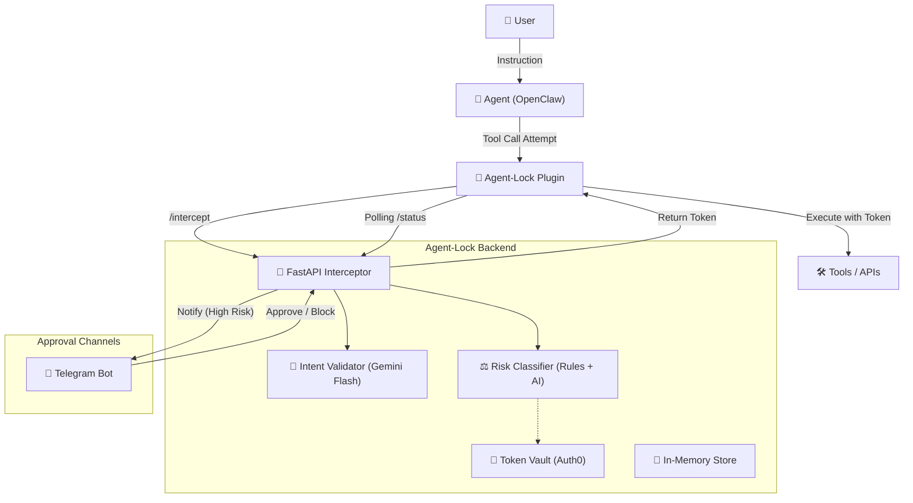

# 🛡️ Agent-Lock Architecture

> [!IMPORTANT]
> **Contribution Rule — English Only**
> All contributors editing this file (or any file in this repository) **must write
> all content in English** — code, comments, documentation, commit messages, and
> variable names. Pull requests containing Spanish (or any other language) will be
> rejected until corrected.

Agent-Lock is a **governance and security layer** designed to intercept, validate, and authorize actions from AI agents (initially focused on OpenClaw).

## 1. Overview

The system acts as a "semantic firewall". Instead of allowing an agent to use long-lived credentials and execute any command, Agent-Lock:
1. Intercepts the agent's intent.
2. Contextualizes it against the user's original instruction.
3. Classifies the risk.
4. Requests human approval if necessary.
5. Injects ephemeral tokens with minimum permissions for execution.

---

## 2. Component Diagram (Mermaid)

---

## 3. Module Breakdown

### 🧠 Intent Validator (`backend/engine/intent_validator.py`)
Uses **Gemini 2.0 Flash** for deep semantic analysis.
- **Input:** User instruction vs. Agent's technical action.
- **Output:** Score (0-1), list of contradictions, and natural language analysis.
- **Fallback:** Keyword-based system if the AI API fails.
- **Empty Intent Detection:** If `user_intent` is generic (e.g., `"[OpenClaw session]"`), Gemini is NOT invoked. A neutral score (0.85) is returned to avoid escalating risk without real evidence.

### ⚖️ Risk Classifier (`backend/engine/risk_classifier.py`)
Hybrid decision engine assigning levels: `LOW`, `HIGH`, `CRITICAL`.
- **Static Rules:** Regex patterns in `action_rules.py` (e.g., blocks `rm -rf`, `DROP TABLE`).
- **`LOW_SHELL_PATTERNS`:** List of explicitly safe commands (`Write-Host`, `echo`, `Get-*`, `ls`, etc.). If the command content matches, the tool's risk is **downgraded** (e.g., `exec` is `HIGH` by default, but `exec Write-Output hello` is classified as `LOW`).
- **AI Escalation:** Only if Gemini detects explicit contradictions **AND** the score is `< 0.3`.
- **Dynamic Policies:** Support for `policies.json` for custom business rules.

### 🔑 Token Vault (`backend/auth/token_vault.py`)
Integrates with **Auth0** to eliminate "hardcoded" credentials.
- Supports two flows:
  - M2M scoped token (`client_credentials`) for generic internal scopes.
  - **Auth0 Token Vault connected-account exchange** using:
    `urn:auth0:params:oauth:grant-type:token-exchange:federated-connection-access-token`
    with `connection=<provider>`.
- For provider integrations (Google/GitHub/Slack), Agent-Lock can run in broker mode and call external APIs itself (`/vault/*`) so provider tokens are not exposed to agents.

### 📱 Notification System (`backend/notifications/telegram_bot.py`)
Handles the **Human-in-the-loop (HITL)** flow.
- Sends approval cards with risk details and AI analysis.
- Receives callbacks to approve or block actions in real-time.
- **Note:** Requires a **separate** Telegram bot from the one used by the agent (OpenClaw) to avoid the `409 Conflict` error on `getUpdates`.

### 🔌 OpenClaw Plugin (`plugin/agent-lock-plugin/src/index.ts`)
Interception layer running inside the OpenClaw process.
- **User Intent Capture:** Uses two OpenClaw SDK mechanisms to get the real user message:
  1. `api.onMessage(ctx)` → captures raw text arriving at the gateway (`ctx.message.body`), stores it in RAM indexed by `ctx.sessionKey`.
  2. `hooks.before_prompt_build(ctx)` → accesses the full `ctx.session.messages[]` history, filters for `role === "user"`, and saves the latest message.
- **Argument Reading:** OpenClaw passes tool parameters in `event.params` (not `event.args`).
- **Dual Polling:** Waits for user decision via backend polling (`/status/{id}`) or via `api.registerTool("agent_lock_respond")` if the user replies in-chat.

---

## 4. Data Flow (Tool Call Intercept)

1. **Interception:** The plugin captures the `tool_call` before it's sent to the tool.
2. **Analysis:** The backend receives the context and runs the Intent Validator + Risk Classifier.
3. **Automatic Decision (LOW Risk):**
   - Access token requested from Auth0.
   - If provider integration is brokered: backend keeps provider token internal and executes through `/vault/*` endpoint path.
   - Otherwise backend may return scoped token for compatible tool integrations.
4. **Manual Decision (HIGH/CRITICAL Risk):**
   - Backend responds with `PENDING` status.
   - Plugin enters a polling loop.
   - Alert sent to Telegram.
   - Human approves → Backend injects the token in the next polling response.
   - Plugin executes the tool.

---

## 5. OpenClaw SDK Findings (Gained in Production)

These details were discovered by analyzing real OpenClaw behavior in production:

| Finding | Detail |
|---|---|
| **`event.params` vs `event.args`** | OpenClaw passes tool arguments in `event.params`, not `event.args`. The `before_tool_call` event only contains `{ toolName, params }`. |
| **Missing User Intent** | The `before_tool_call` event DOES NOT include the original user message. It must be captured separately. |
| **`api.onMessage(ctx)`** | Hook that triggers when a message arrives at the gateway. Contains `ctx.message.body` and `ctx.sessionKey`. Correct method for capturing user prompt. |
| **`hooks.before_prompt_build(ctx)`** | Lifecycle hook with access to `ctx.session.messages[]`. Allows filtering by `role === "user"` and reading full history. |
| **Strategy 5 — Deep Search** | As a last resort inside `before_tool_call`, the plugin recursively traverses `event.session`, `event.context`, `event.request`, `event.metadata`, and the event itself looking for `role=\"user\"` nodes or text fields. This ensures Gemini always receives the user message even when prior hooks didn't fire. |
| **`exec` Tool Name** | OpenClaw uses `exec` as a generic tool for shell commands. The actual command is in `params.command`. |
| **Telegram 409 Conflict** | If OpenClaw and Agent-Lock share the same Telegram bot token, `getUpdates` conflicts. Solution: use separate bots. |
| **`user_intent` Optional** | The backend `ToolCallRequest` model sets `user_intent` as `Optional[str]` (defaults to `""`). If empty, the intent validator skips Gemini and returns a neutral score (0.85), relying solely on static rules. |

---

## 6. Current Status and Observations

> [!NOTE]
> The architecture is currently in the **Stabilized Professional MVP** phase.

- **Storage:** System uses an in-memory store (`store.py`). Next improvement: Redis.
- **Auditing:** All actions are logged in `backend/audit/logs/` in structured JSON format.
- **Isolation:** Backend is agnostic; API contract allows integrating other agents besides OpenClaw.
- **Auth0:** Configured with API `https://agent-lock-api` and scopes `read:files`, `write:db`, `admin:execute`, etc.

---
*Documentation updated March 13, 2026. All editing must be done in English.*
